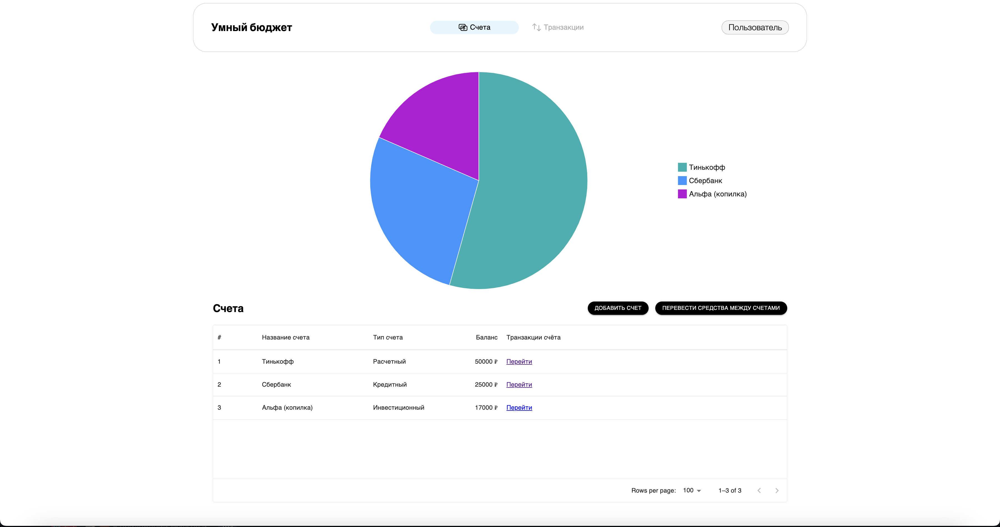
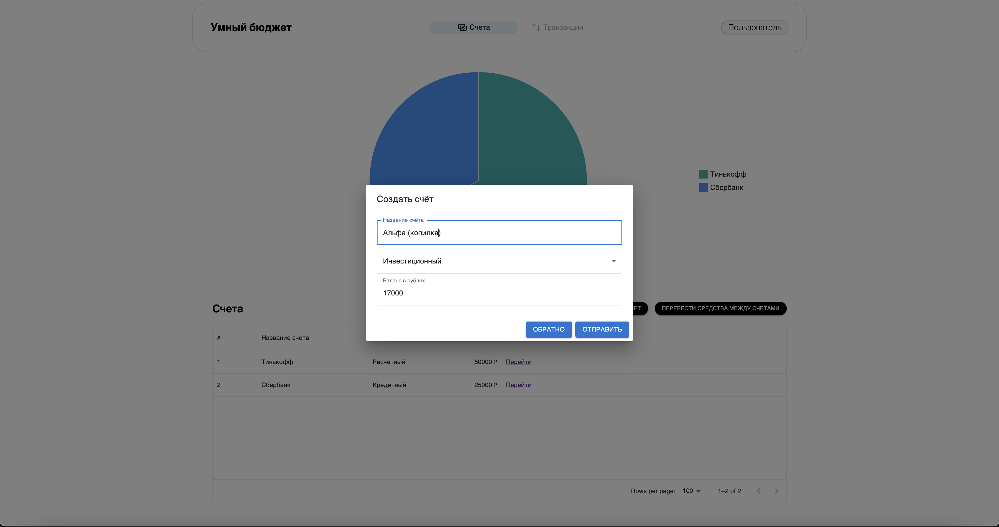
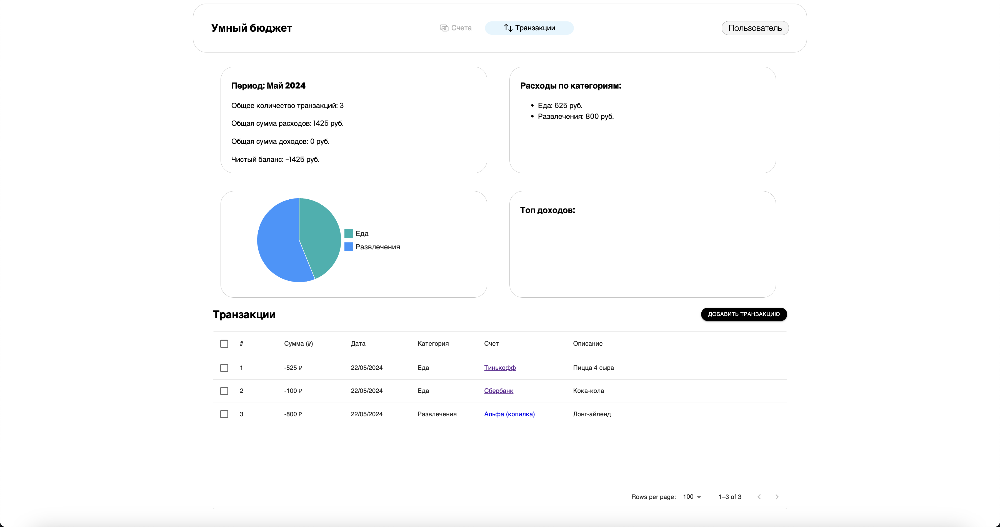
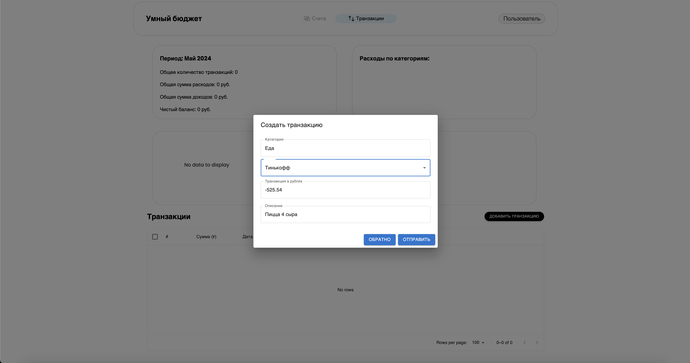

# Проект "Умный бюджет" на React.js + Redux Toolkit + Material UI 💰

#### [ДЕМО](https://664e8462ab580a6410858848--beamish-platypus-aa3b87.netlify.app/)

---

## 📋 Описание проекта

"Умный бюджет" — это приложение для управления личными финансами, разработанное с использованием React.js, Redux Toolkit и Material UI. Оно позволяет пользователям легко отслеживать свои доходы и расходы, планировать бюджет и анализировать финансовые данные с помощью удобного интерфейса.

---

## 📋 Нужно сделать

- [ ] Адаптивную верстку.

- [ ] Работу с фейк сервером, используя React Query.

- [ ] Оптимизация кода, а также проверка PropTypes.

... еще много другого ...

---
<!-- 
## 📦 Установка

Для запуска проекта на вашем компьютере выполните следующие шаги:

1. **Клонируйте репозиторий:**

```bash
git clone https://github.com/username/smart-budget.git
```

2. **Перейдите в директорию проекта:**

```bash
cd smart-budget
```

3. **Установите зависимости:**

```bash
npm install
```

4. **Запустите приложение:**

```bash
npm start
```

Приложение будет доступно по адресу `http://localhost:3000`.

--- -->

## 🚀 Функционал

- **Управление счетами:**
  - Создание и редактирование счетов
  - Просмотр баланса по каждому счёту
  - Фильтрация

- **Управление транзакциями:**
  - Добавление доходов и расходов
  - Категоризация транзакций
  - Фильтрация и сортировка транзакций

- **Отчёты и аналитика:**
  - Диаграммы расходов и доходов
  - Анализ финансовых данных за выбранный период

---

## 🛠️ Технологии

- **React.js** — библиотека для создания пользовательских интерфейсов
- **Redux Toolkit** — инструмент для управления состоянием приложения
- **Material UI** — библиотека компонентов для создания красивых и функциональных интерфейсов

---

## 📸 Основные экраны интерфейса

### Экран аккаунтов



### Диалог добавления/редактирования аккаунта



### Экран транзакций



### Диалог добавления/редактирования транзакции



---


## 📞 Контакты

Telegram: nmequalmn
Email: meregodz@gmail.com

---
